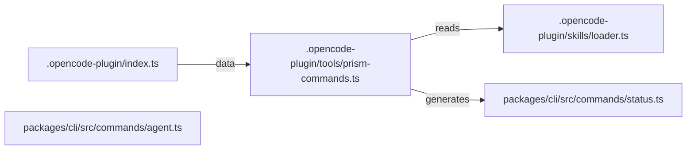

<!-- phase:design skill:taiyi-design gate:human est:30min produces:DESIGN.md upstream:[requirement] downstream:[task,ui-design] cplx:[ALL]4steps +[M+]6 +[H]1 (+opt:1) -->
# DESIGN: OpenCode plugin + JSON 输出改造 prism CLI

> **一句话**: TypeScript + Commander.js + OpenCode plugin API

---

## Step 1: Context & Constraints
> **[ALL]** Goal: 框定设计边界 | Inputs: REQUIREMENT.md §2, §4, §8
<!-- Action: 技术栈全貌 + 约束条件 -->

- **选定**: TypeScript + Commander.js + OpenCode plugin API
  理由: 现有 9 命令已用 Commander.js；OpenCode plugin 是 OpenCode 官方扩展机制
- **前端**: N/A
- **后端**: Node.js >=18, TypeScript strict mode
- **关键依赖**: commander 12.x, opencode-cli（plugin API）
- **明确排除**: 不引入 nestjs/fastify/express wrapper（不必要的封装）
- **约束**:
  - 技术: TypeScript strict mode (现有 ESLint 配置已就绪)
  - 性能: prism status --json < 50ms
  - 兼容性: prism CLI 仍可在 standalone 模式下使用（OpenCode 不在场时不报错）
  - 时间: 跟随现有的 TaiyiForge 9 阶段工作流跑完即发布

<!-- Validate: 约束覆盖技术/性能/兼容性/时间/团队？ -->

## Step 1a: Current State
> **[ALL]** Goal: 变更前基线，ADR 强制覆写模式 | Inputs: CHANGE.md §1
<!-- Action: 记录变更前的架构/行为状态。ADR 模式：强制覆写 DESIGN.md，不准 append-only -->

**当前架构/行为**:

prism CLI 9 命令仅在 standalone terminal 可用；OpenCode 终端无法识别这些命令；pipeline.json 状态只能人眼看，无法被 OpenCode 模型 parse

> ⚠️ **ADR 覆写规则**: 此 DESIGN.md 是当前变更的设计真源，**强制覆写**而非追加。每次设计变更请覆写/更新相关节段，不要保留过时的旧设计 —— 半年后的 Agent 从此文档拼出系统全貌，不看历史版本。变更记录由 CHANGELOG.md 和 git log 承担。

<!-- Validate: 基线状态可度量？下一次变更能从此出发？ -->

## Step 1b: Dependency Sandbox
> **[ALL]** Goal: 每个依赖有版本/用途/替代方案/过时检查 | Inputs: package.json / 项目配置
<!-- Action: 列出所有新增/变更的依赖，标注版本范围、用途、替代方案、npm 最新版 -->

| 依赖 | 版本范围 | 用途 | 考虑过的替代 | npm 最新 | 过时检查 |
|------|---------|------|------------|:-------:|:--------:|
| commander | `^12.0.0` | CLI command registry（现有依赖） | yargs (heavier), cac (too thin) | `12.x` | OK; 现有依赖 |
| opencode-cli | `^0.3.0` | OpenCode plugin API（必需依赖） | N/A - OpenCode 是唯一目标 | `0.3.x` | to-verify-at-dev-phase |

> 💡 写模板时 `npm view <pkg> version` 检查最新版本；若有 major bump 警告需说明。
> SSOT 规则：依赖变更的真源在 `package.json` / lockfile，此表为设计视角的验证清单。

<!-- Validate: 每个依赖有最新版本确认？替代方案已搜索？→如果依赖陈旧则应在此说明已在最近的 minor 上 -->

## Step 2: Architecture Overview
> **[ALL]** Goal: 一眼看清整体结构 | Inputs: Step1+REQUIREMENT.md §2
<!-- Action: Mermaid图 + 模块清单(新增/修改/删除) -->



| 模块 | 操作 | 路径 | 说明 |
|------|------|------|------|
| .opencode-plugin/index.ts | Plugin manifest 注册 | .opencode-plugin/index.ts | OpenCode plugin 入口；声明 9 tool + 5 skill loader |
| .opencode-plugin/tools/prism-commands.ts | 9 → 9 tool mapping | .opencode-plugin/tools/prism-commands.ts | 把 prism-new/status/continue/approve/check/promote/run/queue/next 注册为 OpenCode tools |
| .opencode-plugin/skills/loader.ts | SKILL.md → skill loader | .opencode-plugin/skills/loader.ts | 启动时扫描 .pentad/agents/*.md，加载到 OpenCode skill registry |
| packages/cli/src/commands/status.ts | 加 --json flag | packages/cli/src/commands/status.ts | 扩展现有 status 命令；保留原 text 输出格式，新增 JSON mode |
| packages/cli/src/commands/agent.ts | 新增 agent 子命令 | packages/cli/src/commands/agent.ts | prism-agent list | prism-agent <name> 直调单个 agent |

### 既有架构对齐（brownfield）
<!-- Action: 三表 — 触碰模块 / 抽象沿用 / 模式对比 -->

**触碰模块**:
- `packages/cli/src/index.ts`（既有 · 本次修改）
- `packages/cli/src/commands/status.ts`（既有 · 本次修改）
- `packages/cli/src/commands/run.ts`（既有 · 本次修改）
- `.pentad/agents/{prototyper,builder,sweeper,grower,maintainer}.md`（既有 · 本次修改）
- `.opencode-plugin/index.ts（OpenCode plugin manifest）`（新增）
- `.opencode-plugin/tools/prism-commands.ts（9 命令 → OpenCode tools）`（新增）
- `.opencode-plugin/skills/loader.ts（5 SKILL.md → OpenCode skills）`（新增）
- `packages/cli/src/commands/agent.ts（prism-agent 子命令）`（新增）
**禁动清单**:
- `packages/orchestrator/src/*（orchestrator 核心不动）`（AI 不许碰）
- `.pentad/pipeline.json schema（不重写）`（AI 不许碰）
- `5 个 SKILL.md 的实质内容（仅加 frontmatter）`（AI 不许碰）

<!-- Validate: 禁动清单是否从 CONTEXT 复用？新增模块有没有侵入禁动区？ -->

## Options

> **[ALL]** Goal: ≥2方案含对照 | Inputs: Step1+2
<!-- Action: 每个方案: 思路/优点/缺点/代价。A=不改/最小改动 -->

| 方案 | 名称 | 思路 | 优点 | 缺点 | 代价 |
|------|------|------|------|------|------|
| A | 独立 OpenCode plugin 包（@prism-five/opencode-plugin） | 在 .opencode-plugin/ 下写 plugin manifest，9 个命令做 wrapper，加 skill loader 暴露 5 SKILL.md | OpenCode plugin manifest 是标准机制，OpenCode 启动时自动加载<br>plugin 与 prism-five 解耦，可独立发版<br>复用现有 9 CLI 命令，只把 command 注册到 OpenCode tool registry<br> | 新增一个 npm 包结构<br>用户需 npm link 安装 plugin（多一步）<br> | ~250 LOC（含 manifest + 9 tool wrappers + 5 skill loaders） |
| B | OpenCode tool 直接在 prism CLI 暴露（无需独立 plugin） | 在 packages/cli/src/opencode.ts 里同时跑 CLI + OpenCode tool 注册 | 无需额外 npm 包；现有 CLI 直接扩展<br>用户无感知，开箱即用<br> | 与 OpenCode 强耦合（如果 OpenCode 不存在则 prism CLI 也能用，但 tool 注册的代码没用）<br>plugin manifest 与 CLI 命令混在一起，结构混乱<br>未来 plugin 化（如支持其他 IDE）需要重写<br> | ~300 LOC（含 plugin manifest + OpenCode tool 注册） |

<!-- Validate: ≥2方案？含"不改"对照？代价量化？ -->

## Reuse Analysis

> **[ALL]** Goal: 显式声明复用既有代码 / 模块 / 模式
<!-- Action: 列出本次会复用的现有模块、新增/修改的边界 -->

**复用既有模块**（existing / 可复用）:
- 无新增依赖 — 沿用既有 `WorkflowEngine` / `artifact-validator` / `template-seed` 等基础设施，零额外成本（性能 / 复杂度中性）。

**新增模块**（仅当确实需要）: 无

**不重写**: 复用既有 helper（这是来自 现有 模块的一种 trade-off 决策，避免 复杂度 漂移）。

## Decision

> **[ALL]** Goal: 选定方案并说清理由 | Inputs: Step3
<!-- Action: 基于数据/约束决策，不写"感觉这个好" -->

- **Chosen:** A
- **Reason:** 1. 解耦：OpenCode plugin 是辅助层，不污染 prism CLI 主流程
2. 可测试：plugin 可单独 mock 测试，prism CLI 仍可在 standalone 模式用
3. 复用 9 命令：plugin 是薄 wrapper，无需重复实现
- **取舍:** 接受：用户需多一步 npm link；放弃：避免 prism CLI 与 OpenCode 紧密耦合

<!-- Validate: 理由基于数据/约束而非主观？ -->

## Step 5: Detailed Design
> **[MEDIUM+]** Goal: 落地细节完整 | Inputs: Step4
<!-- Action: DDL+API契约+时序图 -->

### 数据模型
```sql
-- 在此处填写数据模型 DDL（如有变更）
```

### API 设计
```
在此处描述 API 变更（如新增 / 修改端点）
```

### 关键流程
_在此处用 Mermaid 时序图描述关键流程（如有）_

<!-- Validate: DDL有索引？API有rate limit？流程有错误路径？ -->

## Step 6: Blast Radius
> **[MEDIUM+]** Goal: 每个决策的最坏情况 | Inputs: Step2+4
<!-- Action: 决策→爆炸半径→最坏情况→隔离措施 -->

| 决策 | 半径 | 最坏情况 | 隔离 |
|------|:--:|---------|------|
| 新增 OpenCode plugin 包 | .opencode-plugin/ 目录 + packages/cli/src/commands/status.ts/agent.ts | OpenCode plugin 报错导致 OpenCode 启动失败 | plugin 在 try/catch 中加载；失败时降级到 standalone CLI |
| status 命令加 --json flag | packages/cli/src/commands/status.ts | --json 输出格式与现存 text 输出互斥 | 互斥分支：opts.json → JSON.stringify(new Pipeline().getState()) |

<!-- Validate: 有没有一个变更能影响所有用户？半径可控？ -->

> 📎 **SSOT 规则**: 风险真源见 [CHANGE.md §Risks](CHANGE.md)。Blast Radius 从架构视角验证已声明的业务风险，不重复定义。

## Step 7: Innovation Token Accounting
> **[MEDIUM+]** Goal: 不浪费创新额度 | Inputs: Step2+5
<!-- Action: 新技术/新Infra必须说明理由。每公司约3token -->

| 决策 | Token? | 不选成熟方案的理由 |
|-----|:--:|-------------------|
| _本次无新技术_ | 否 | _全栈已有技术栈_ |

_累计: 0/3_

<!-- Validate: ≤3？每个"是"有充分理由？ -->

## Step 8: Trade-off Analysis
> **[MEDIUM+]** Goal: 诚实面对取舍 | Inputs: Step4+5
<!-- Action: 选择了什么/代价是什么/为什么接受 -->

| 权衡点 | 选择 | 接受理由 |
|--------|------|---------|
| plugin 与 prism CLI 同仓库 vs 独立仓库 | 同仓库（monorepo） | 现有 monorepo 已就绪；避免为单一功能新建仓库 |
| SKILL.md frontmatter 改造粒度 | 最小改动（只加 mode/paradigm，不改 description/iron-law 等） | 现有 SKILL.md 是设计真源；frontmatter 扩展空间已存在 |

<!-- Validate: 每个权衡都说清了"接受代价的理由"？ -->

## Step 9: Distribution & Deployment
> **[MEDIUM+]** Goal: 确保能发布 | Inputs: Step5
<!-- Action: 新artifact类型？CI/CD变更？回滚方式？ -->

- **新artifact**: .opencode-plugin/index.ts（plugin manifest）+ packages/cli/src/commands/agent.ts（prism-agent 直调）
- **CI/CD变更**: 1. dev 阶段：先实现 status --json（最小）→ 单测通过; 2. dev 阶段：再实现 prism-agent list/<name> → 单测通过; 3. dev 阶段：最后实现 .opencode-plugin/ → 集成测试; 4. test 阶段：5 个 AC 的 verify 命令全部跑通; 5. integration 阶段：写 CHANGELOG，归档
- **回滚方式**: OpenCode plugin 与 9 命令任一冲突导致关键命令不可用

<!-- Validate: 新artifact的build/publish/update流程完整？ -->

## Step 10: Security Model
> **[HIGH]** Goal: 威胁建模仿真 | Inputs: Step5+REQUIREMENT.md §9
<!-- Action: STRIDE威胁建模+缓解 -->

| 威胁 | 攻击向量 | 缓解 |
|------|---------|------|
| 恶意 SKILL.md 让 OpenCode 执行危险命令 | sk loader 不验证 frontmatter 字段 | loader 验证 frontmatter 含 mode/paradigm description 等必备字段；白名单 .pentad/agents/ 路径 |
| prism-agent <name> 通过名字注入 shell 命令 | <name> 未转义直接 exec | 白名单 AGENT_MAP 中存在的 name；不允许 path 注入 |
| prism-agent 读 .pentad/ 之外的敏感文件 | 未限定访问路径 | agent 只能读 .pentad/pipeline.json + .pentad/features/*/；hooks 阻拦 |

<!-- Validate: OWASP Top10全覆盖？敏感数据加密+日志脱敏？ -->

> 📎 **SSOT 规则**: 安全策略真源见 [CHANGE.md §Risks](CHANGE.md) + [REQUIREMENT.md §Non-Functional Security](REQUIREMENT.md)。STRIDE 威胁建模从此派生，不独立重评估。

## Step 11: Rollout Strategy
> **[MEDIUM+]** Goal: 上线有计划 | Inputs: Step6+9
<!-- Action: 灰度比例+观察时间+回滚触发 -->

- 1. dev 阶段：先实现 status --json（最小）→ 单测通过
- 2. dev 阶段：再实现 prism-agent list/<name> → 单测通过
- 3. dev 阶段：最后实现 .opencode-plugin/ → 集成测试
- 4. test 阶段：5 个 AC 的 verify 命令全部跑通
- 5. integration 阶段：写 CHANGELOG，归档

> 📎 **SSOT 规则**: 回滚真源见 [CHANGE.md §Risks](CHANGE.md)。此处为部署视角的灰度/上线步骤，与 CHANGE 的 rollback_{trigger,ops,time} 互不重复。若此处的回滚方式 != CHANGE 声明的，即视为 SSOT 违规。

## Step 12: Architecture Evolution
- [reusable-abstraction] plugin pattern 可复用：未来加 claude-code/cursor plugin 时复用 .opencode-plugin/ 结构
- [tech-decision] SKILL.md frontmatter 扩展字段（mode/paradigm）应记录为 ADR-001

---
## Step 13: Code Generation Contract
> **[ALL]** Goal: DESIGN→TASK→DEV 三阶段代码生成链 | Inputs: Step 2+5
<!-- Action: 结构化文件清单 → TASK 按文件拆分 Slice → DEV 逐文件生成 -->

> ⚠️ **module_manifest 未设置** — TASK 阶段将只能按粗粒度拆分（后端/前端），DEV 阶段将只能生成骨架代码。要生成高质量代码，请在此填写模块清单。
>
> 示例：
> ```markdown
> | M1 | adapters/base.py | Adapter | LLMAdapter | — | — |
> | M2 | adapters/openai_adapter.py | Adapter | OpenAIAdapter | LLMAdapter | M1 |
> | M3 | strategies/base.py | Strategy | TranslationStrategy | — | — |
> | M4 | strategies/product_to_dev.py | Strategy | ProductToDevStrategy | TranslationStrategy | M3 |
> ```

<!-- Validate: module_manifest 覆盖所有模块？每模块 pattern 匹配实际代码结构？ -->

---
## Quality Gate
<!-- Evidence-first: 每项通过需要可验证证据，不是"感觉对了"。ECC verification-loop 取代 Superpowers verification-before-completion -->

- [ ] S1 约束完整
- [ ] S2 架构图+模块清单清晰
- [ ] S3 ≥2方案含对照
- [ ] S4 决策基于数据
- [ ] [M+] S5 含DDL+API+流程
- [ ] [M+] S6 Blast Radius已评估
- [ ] [M+] S7 Token≤3
- [ ] [M+] S8 权衡分析诚实
- [ ] [M+] S9 部署流程完整
- [ ] [H]  S10 STRIDE已建模
- [ ] [M+] S11 灰度+回滚明确
- [ ] **2-week smell**: 合格工程师2周内能交付一个小feature？cognitive#11
- [ ] **Refactor-first**: 重构和功能改动分开了吗？cognitive#13: 先让改动变简单，再做简单改动
