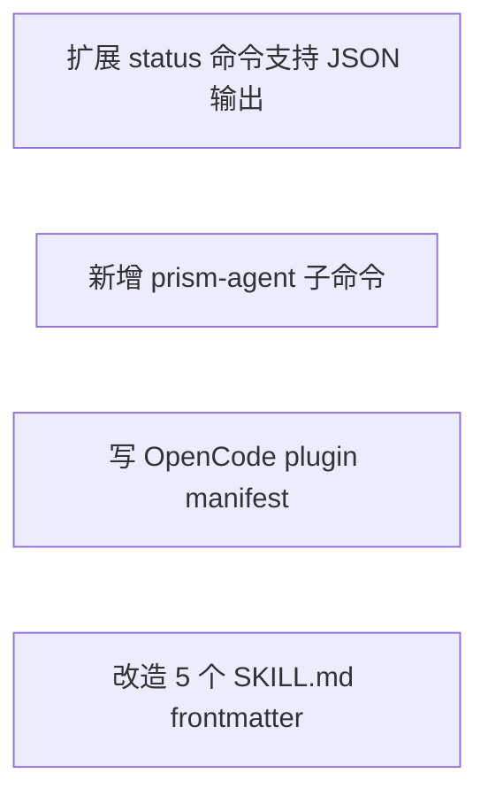

<!-- phase:task skill:taiyi-task gate:auto est:15min produces:TASK.md upstream:[design,requirement] downstream:[dev,test] cplx:[ALL]2steps +[M+]2 +[H]1 -->
# TASK: OpenCode plugin 集成 prism CLI

> **总Slice**: 4 | **预估**: 1-2 | **并行**: 3

---

## Step 1: Dependency Graph
> **[ALL]** Goal: 一眼看清依赖 | Inputs: DESIGN.md
<!-- Action: Mermaid图，箭头=依赖 -->

<!-- Validate: 无循环依赖 -->

---

## Slices

> **[ALL]** Goal: 每个Slice独立可交付 | Inputs: Step1+DESIGN.md §5
<!-- Action: 每个Slice=独立PR，含文件清单/验证命令/验收点/依赖/并行性/Completeness -->

### Slice S1: 扩展 status 命令支持 JSON 输出
> **[ALL]** | ⇧ 无 | ⇶ ✅可并行 | Score: [N]/10 — 评估基准: read_files√ + write_files√ + verify√ + checkpoints≥3 + rollback√ = 8/10+

给 packages/cli/src/commands/status.ts 加 --json flag，输出 machine-readable JSON

**read_files**（只读 · 不写）:
- _在此列出只读参考文件（不需要修改的源头代码）_

**write_files**（写边界 · 不越界）:
<!-- R7.3 强约束: 不碰禁动清单，不顺手改其他文件 -->
- `packages/cli/src/commands/status.ts`

**验证**: `npm run build && npx prism status --json | python3 -c 'import sys,json; d=json.load(sys.stdin); assert d.get("type") in ("success","error")'`

**物理锚点**（git-diff 确认 write_files 已被实际修改）:
> 🪝 `git diff --name-only packages/cli/src/commands/status.ts`

**验收点**:
⬜ _在此列出验收项（各至少一条通过条件）_

<!-- Validate: 可独立merge/deploy？文件范围精确？ -->

---

### Slice S2: 新增 prism-agent 子命令
> **[ALL]** | ⇧ Slice S1 | ⇶ ❌须顺序 | Score: [N]/10 — 评估基准: read_files√ + write_files√ + verify√ + checkpoints≥3 + rollback√ = 8/10+

新增 packages/cli/src/commands/agent.ts：list 列 132 agent（按角色分组）/ <name> "<prompt>" 直调单个 agent

**read_files**（只读 · 不写）:
- _在此列出只读参考文件（不需要修改的源头代码）_

**write_files**（写边界 · 不越界）:
<!-- R7.3 强约束: 不碰禁动清单，不顺手改其他文件 -->
- `packages/cli/src/commands/agent.ts`
- `packages/cli/src/index.ts（注册 subCommand）`

**验证**: `npm run build && npx prism agent list 2>&1 | head -10 ; echo "---" ; npx prism agent pentad-rapid-prototyper 'design login UI' 2>&1 | head -20`

**物理锚点**（git-diff 确认 write_files 已被实际修改）:
> 🪝 `git diff --name-only packages/cli/src/commands/agent.ts packages/cli/src/index.ts`

**验收点**:
⬜ _在此列出验收项（各至少一条通过条件）_

<!-- Validate: 可独立merge/deploy？文件范围精确？ -->

---

### Slice S3: 写 OpenCode plugin manifest
> **[ALL]** | ⇧ Slice S1, S2 | ⇶ ❌须顺序 | Score: [N]/10 — 评估基准: read_files√ + write_files√ + verify√ + checkpoints≥3 + rollback√ = 8/10+

创建 .opencode-plugin/ 目录，写 plugin manifest 注册 9 tools + 5 skills

**read_files**（只读 · 不写）:
- _在此列出只读参考文件（不需要修改的源头代码）_

**write_files**（写边界 · 不越界）:
<!-- R7.3 强约束: 不碰禁动清单，不顺手改其他文件 -->
- `.opencode-plugin/index.ts`
- `.opencode-plugin/tools/prism-commands.ts`
- `.opencode-plugin/skills/loader.ts`
- `.opencode-plugin/package.json`

**验证**: `cd .opencode-plugin && npm install && npx tsc --noEmit`

**物理锚点**（git-diff 确认 write_files 已被实际修改）:
> 🪝 `ls -la .opencode-plugin/ && cat .opencode-plugin/package.json`

**验收点**:
⬜ _在此列出验收项（各至少一条通过条件）_

<!-- Validate: 可独立merge/deploy？文件范围精确？ -->

---

### Slice S4: 改造 5 个 SKILL.md frontmatter
> **[ALL]** | ⇧ Slice S3 | ⇶ ✅可并行 | Score: [N]/10 — 评估基准: read_files√ + write_files√ + verify√ + checkpoints≥3 + rollback√ = 8/10+

5 个核心 SKILL.md (.pentad/agents/*.md) frontmatter 加 mode/paradigm 字段满足 OpenCode skill loader

**read_files**（只读 · 不写）:
- _在此列出只读参考文件（不需要修改的源头代码）_

**write_files**（写边界 · 不越界）:
<!-- R7.3 强约束: 不碰禁动清单，不顺手改其他文件 -->
- `.pentad/agents/prototyper.md`
- `.pentad/agents/builder.md`
- `.pentad/agents/sweeper.md`
- `.pentad/agents/grower.md`
- `.pentad/agents/maintainer.md`

**验证**: `grep -l 'mode:' .pentad/agents/*.md | wc -l  # 应 = 5`

**物理锚点**（git-diff 确认 write_files 已被实际修改）:
> 🪝 `git diff --name-only .pentad/agents/`

**验收点**:
⬜ _在此列出验收项（各至少一条通过条件）_

<!-- Validate: 可独立merge/deploy？文件范围精确？ -->

---

## Checklist per slice

- [ ] 测试先行（RED）— 每个 Slice 先写失败测试
- [ ] 最小实现（GREEN）— 让测试通过
- [ ] 重构（REFACTOR）— 不改变行为
- [ ] Done when includes npm test command
- [ ] 更新追溯（REQUIREMENT AC ↦ 测试用例）

## Step 3: Execution Plan
> **[MEDIUM+]** Goal: 分Wave并行执行 | Inputs: Step2
<!-- Action: 按依赖图分组，无依赖的同Wave并行 -->

### Wave Wave 1: baseline
- S1: 扩展 status 加 --json
### Wave Wave 2: extending CLI
- S2: prism-agent 子命令
### Wave Wave 3: OpenCode integration
- S3: OpenCode plugin manifest
- S4: SKILL.md frontmatter 改造

<!-- Validate: 每Wave内部确实无依赖？ -->

## Step 4: Risk per Slice
> **[MEDIUM+]** Goal: 每个Slice风险独立评估 | Inputs: Step2+DESIGN.md §6
<!-- Action: Slice→风险→概率→缓解 -->

| Slice | 风险 | 概率 | 缓解 |
|-------|------|------|------|
| S3 | OpenCode plugin API 与 commander.js 冲突 | medium | plugin 是独立 package.json，与 prism CLI 解耦；plugin 失败时 fallback standalone |

<!-- Validate: 高风险Slice有独立回滚？ -->

## Step 5: Rollback per Slice
> **[HIGH]** Goal: 每个Slice可独立安全回退 | Inputs: Step4
<!-- Action: 回滚方式+预计时间+数据影响 -->

| Slice | 回滚方式 | 时间 | 数据影响 |
|-------|---------|------|---------|
| S1 | git revert S1 commit | ≤5min | none |
| S3 | rm -rf .opencode-plugin/ | ≤1min | none（plugin 不动 pipeline.json） |

<!-- Validate: 每个Slice可独立回滚？数据一致性？ -->

> 📎 **SSOT 规则**: 切片风险基于 [DESIGN.md §Blast Radius](DESIGN.md) 细分，不回重新评估。切片回滚基于 [CHANGE.md](CHANGE.md) 的 rollback_{trigger,ops,time} 做切片级适配（≤5min/md-only）。
>
> 📎 **多 Slice 并行模式**: 若变更拆为多个可并行发版的 Slice（对应独立 PR），每个 Slice 可生成独立的 `TEST-{slice}.md` 和 `REVIEW-{slice}.md`（ultrawork 模式）。宏观的 TEST.md / REVIEW.md 仅作为阶段级摘要；CI 流式合并以 Slice 级 TEST / REVIEW 为门控单元。

---
## Quality Gate
<!-- Evidence-first: 每个Slice可独立验证交付。cognitive#13: 先重构再实现，不把结构+行为放同一个PR -->

- [ ] S1 依赖图无循环
- [ ] S2 每个Slice可独立交付
- [ ] S2 每个Slice有 read_files/write_files + 验证 + 验收点
- [ ] S2 每个Slice有Completeness评分
- [ ] [M+] S3 Wave分波合理
- [ ] [M+] S4 每Slice风险已评估
- [ ] [H]  S5 每Slice有独立回滚
- [ ] **PITFALLS.md**: 已扫描触达模块的 PITFALLS（`.pitfalls/scan.sh --module <path>` + 人工 grep 关键词），无已知踩坑或已声明规避方案
- [ ] **项目上下文**: 已查 PHASE-CONTEXT.md 既有抽象索引，无重复实现
- [ ] **Refactor-first**: 重构PR和功能PR分开了？(Rule: make change easy, then make easy change)
