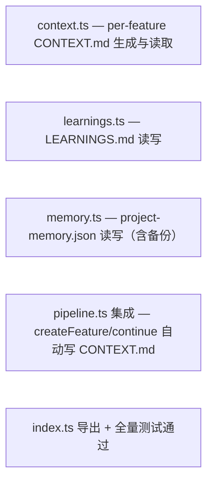

<!-- phase:task skill:taiyi-task gate:auto est:15min produces:TASK.md upstream:[design,requirement] downstream:[dev,test] cplx:[ALL]2steps +[M+]2 +[H]1 -->
# TASK: M14 任务拆解：context / learnings / memory 三模块实现

> **总Slice**: — | **预估**: — | **并行**: —

---

## Step 1: Dependency Graph
> **[ALL]** Goal: 一眼看清依赖 | Inputs: DESIGN.md
<!-- Action: Mermaid图，箭头=依赖 -->

<!-- Validate: 无循环依赖 -->

---

## Slices

> **[ALL]** Goal: 每个Slice独立可交付 | Inputs: Step1+DESIGN.md §5
<!-- Action: 每个Slice=独立PR，含文件清单/验证命令/验收点/依赖/并行性/Completeness -->

### Slice S1: context.ts — per-feature CONTEXT.md 生成与读取
> **[ALL]** | ⇧ Slice 无 | ⇶ ✅可并行 | Score: 

新增 context.ts：saveContext(feature) 生成 CONTEXT.md；loadContext(slug) 解析为结构化对象

**read_files**（只读 · 不写）:
- `packages/orchestrator/src/schema.ts`
- `packages/orchestrator/src/checkpoint.ts`

**write_files**（写边界 · 不越界）:
<!-- R7.3 强约束: 不碰禁动清单，不顺手改其他文件 -->
- `packages/orchestrator/src/context.ts`
- `packages/orchestrator/src/context.test.ts`

**验收点**:

<!-- Validate: 可独立merge/deploy？文件范围精确？ -->

---

### Slice S2: learnings.ts — LEARNINGS.md 读写
> **[ALL]** | ⇧ Slice 无 | ⇶ ✅可并行 | Score: 

新增 learnings.ts：add(entry) append-only 写 LEARNINGS.md；list(filter?) 查询。add() 自动写 activity.jsonl

**read_files**（只读 · 不写）:
- `packages/orchestrator/src/logger.ts`

**write_files**（写边界 · 不越界）:
<!-- R7.3 强约束: 不碰禁动清单，不顺手改其他文件 -->
- `packages/orchestrator/src/learnings.ts`
- `packages/orchestrator/src/learnings.test.ts`

**验收点**:

<!-- Validate: 可独立merge/deploy？文件范围精确？ -->

---

### Slice S3: memory.ts — project-memory.json 读写（含备份）
> **[ALL]** | ⇧ Slice 无 | ⇶ ✅可并行 | Score: 

新增 memory.ts：write/read/delete，写前备份 memory.backup.json，主文件损坏自动 fallback，Zod 验证

**read_files**（只读 · 不写）:
- `packages/orchestrator/src/schema.ts`
- `packages/orchestrator/src/state.ts`

**write_files**（写边界 · 不越界）:
<!-- R7.3 强约束: 不碰禁动清单，不顺手改其他文件 -->
- `packages/orchestrator/src/memory.ts`
- `packages/orchestrator/src/memory.test.ts`

**验收点**:

<!-- Validate: 可独立merge/deploy？文件范围精确？ -->

---

### Slice S4: pipeline.ts 集成 — createFeature/continue 自动写 CONTEXT.md
> **[ALL]** | ⇧ Slice S1 | ⇶ ❌须顺序 | Score: 

修改 pipeline.ts：createFeature/continue 中 try/catch 调用 saveContext()，失败不抛异常

**read_files**（只读 · 不写）:
- `packages/orchestrator/src/pipeline.ts`
- `packages/orchestrator/src/context.ts`

**write_files**（写边界 · 不越界）:
<!-- R7.3 强约束: 不碰禁动清单，不顺手改其他文件 -->
- `packages/orchestrator/src/pipeline.ts`

**验收点**:

<!-- Validate: 可独立merge/deploy？文件范围精确？ -->

---

### Slice S5: index.ts 导出 + 全量测试通过
> **[ALL]** | ⇧ Slice S1, S2, S3, S4 | ⇶ ❌须顺序 | Score: 

修改 index.ts 导出新模块；npm test 全量通过

**read_files**（只读 · 不写）:
- `packages/orchestrator/src/index.ts`

**write_files**（写边界 · 不越界）:
<!-- R7.3 强约束: 不碰禁动清单，不顺手改其他文件 -->
- `packages/orchestrator/src/index.ts`

**验收点**:

<!-- Validate: 可独立merge/deploy？文件范围精确？ -->

---

## Checklist per slice

- [ ] 测试先行（RED）— 每个 Slice 先写失败测试
- [ ] 最小实现（GREEN）— 让测试通过
- [ ] 重构（REFACTOR）— 不改变行为
- [ ] Done when includes npm test command
- [ ] 更新追溯（REQUIREMENT AC ↦ 测试用例）

## Step 3: Execution Plan
> **[MEDIUM+]** Goal: 分Wave并行执行 | Inputs: Step2
<!-- Action: 按依赖图分组，无依赖的同Wave并行 -->

### Wave Wave 1 — 新模块
- S1: context.ts
- S2: learnings.ts
- S3: memory.ts
### Wave Wave 2 — 集成
- S4: pipeline 集成
### Wave Wave 3 — 导出 + 测试
- S5: 导出新模块并运行全量回归测试

<!-- Validate: 每Wave内部确实无依赖？ -->

## Step 4: Risk per Slice
> **[MEDIUM+]** Goal: 每个Slice风险独立评估 | Inputs: Step2+DESIGN.md §6
<!-- Action: Slice→风险→概率→缓解 -->

| Slice | 风险 | 概率 | 缓解 |
|-------|------|------|------|
| S4 | pipeline 集成可能破坏已有 continue() 行为 | low | try/catch 包裹，回归现有测试 |

<!-- Validate: 高风险Slice有独立回滚？ -->

## Step 5: Rollback per Slice
> **[HIGH]** Goal: 每个Slice可独立安全回退 | Inputs: Step4
<!-- Action: 回滚方式+预计时间+数据影响 -->

| Slice | 回滚方式 | 时间 | 数据影响 |
|-------|---------|------|---------|
| S4 | 删除 import 和 context 调用行 | 2min | 无— CONTEXT.md 遗留文件无副作用 |
| S5 | 删除新增 export 语句 | 1min | 无 |

<!-- Validate: 每个Slice可独立回滚？数据一致性？ -->

> 📎 **SSOT 规则**: 切片风险基于 [DESIGN.md §Blast Radius](DESIGN.md) 细分，不回重新评估。切片回滚基于 [CHANGE.md](CHANGE.md) 的 rollback_{trigger,ops,time} 做切片级适配（≤5min/md-only）。
>
> 📎 **多 Slice 并行模式**: 若变更拆为多个可并行发版的 Slice（对应独立 PR），每个 Slice 可生成独立的 `TEST-{slice}.md` 和 `REVIEW-{slice}.md`（ultrawork 模式）。宏观的 TEST.md / REVIEW.md 仅作为阶段级摘要；CI 流式合并以 Slice 级 TEST / REVIEW 为门控单元。

---
## Quality Gate
<!-- Evidence-first: 每个Slice可独立验证交付。cognitive#13: 先重构再实现，不把结构+行为放同一个PR -->

- [ ] S1 依赖图无循环
- [ ] S2 每个Slice可独立交付
- [ ] S2 每个Slice有 read_files/write_files + 验证 + 验收点
- [ ] S2 每个Slice有Completeness评分
- [ ] [M+] S3 Wave分波合理
- [ ] [M+] S4 每Slice风险已评估
- [ ] [H]  S5 每Slice有独立回滚
- [ ] **PITFALLS.md**: 已扫描触达模块的 PITFALLS（`.pitfalls/scan.sh --module <path>` + 人工 grep 关键词），无已知踩坑或已声明规避方案
- [ ] **项目上下文**: 已查 PHASE-CONTEXT.md 既有抽象索引，无重复实现
- [ ] **Refactor-first**: 重构PR和功能PR分开了？(Rule: make change easy, then make easy change)
